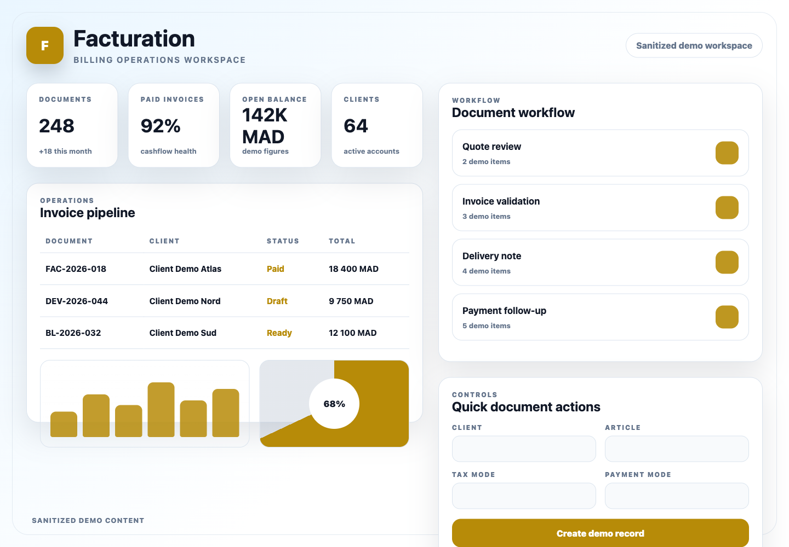
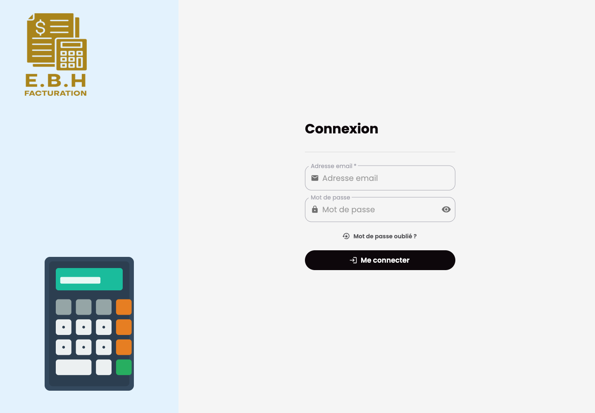

# Facturation Backend

## Purpose

Facturation Backend is the Django API for the billing application. It manages companies, clients, articles, quotes, pro forma invoices, customer invoices, credit notes, delivery notes, payments, dashboards, notifications, and generated documents.

## Stack

- Python and Django
- Django REST Framework
- Simple JWT and dj-rest-auth
- django-filter
- Channels, Daphne, Redis, and Celery
- PostgreSQL
- ReportLab and OpenPyXL
- Pytest and pytest-django

## Features

- Company, user, and permission management
- Client and article catalog APIs
- Quote, invoice, credit note, and delivery note workflows
- Payment tracking and dashboard summaries
- PDF and spreadsheet generation
- Real-time notifications and websocket support

## Setup

Provide local-only variables for Django runtime settings, database, Redis, media storage, and allowed origins. Use localhost values for local development and do not commit local configuration files.

```bash
python -m venv .venv
source .venv/bin/activate
pip install -r requirements.txt
python manage.py migrate
python manage.py runserver 8000
```

## Tests

```bash
python -m pytest
```

## Screenshots

Sanitized product workspace:



Authentication screen:


