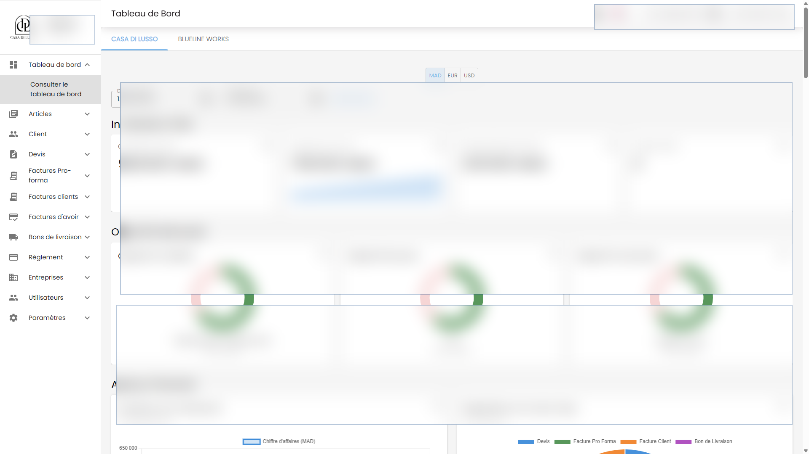
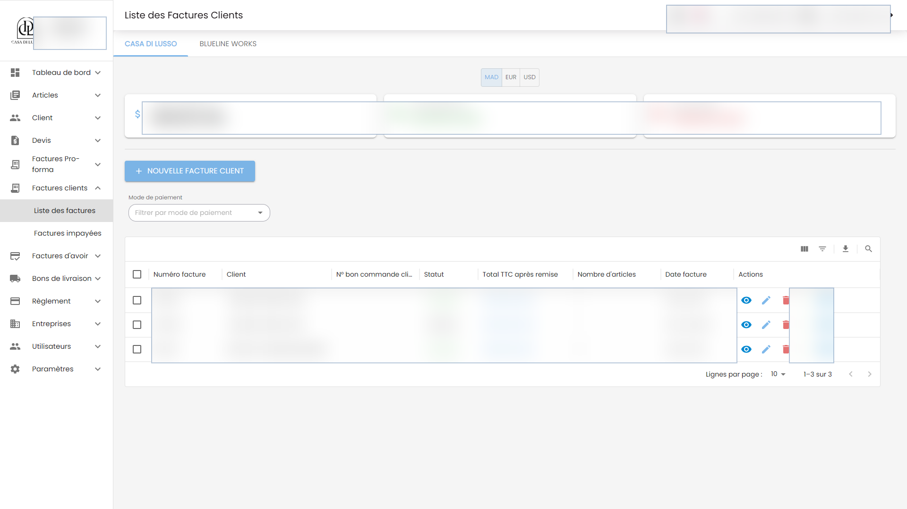

# Facturation Backend

Django REST API for a billing operations platform for quotes, pro-forma invoices, customer invoices, credit notes, delivery notes, payments, clients, articles, company settings, dashboards, notifications, and printable business documents.

This is a production-oriented business backend. It models real operational workflows, authenticated staff access, API filtering, document/report generation, realtime notification plumbing, and testable domain behavior.

## What It Shows

- Backend ownership for a complete internal business application.
- Django REST API design across related business modules.
- PostgreSQL data modeling for operational records and audit/history needs.
- Auth, permissions, SSO subject handling, filters, dashboards, exports, and realtime events.
- Testable backend code with pytest tooling instead of only manual checks.

## Main Modules

- account
- article
- client
- company
- devi
- facture_client
- facture_proforma
- facture_avoir
- bon_de_livraison
- reglement
- dashboard
- notification
- ws

## Key Capabilities

- Django REST API for quote, invoice, credit note, delivery note, payment, client, article, and company workflows.
- Multi-company user access with JWT/session auth, SSO subject support, permission-aware endpoints, and django-axes protection.
- Dashboard totals, settlement tracking, unpaid invoice views, due-date support, history records, filters, search, and export-oriented data models.
- PDF and spreadsheet document generation with ReportLab and OpenPyXL.
- Realtime notifications through Channels, Daphne, Redis, and websocket routing.
- pytest coverage around billing, company, dashboard, document, and credit-note behavior.

## Stack

- Python, Django 6, Django REST Framework
- PostgreSQL, django-filter, django-simple-history
- SimpleJWT, dj-rest-auth, django-axes, CORS
- Redis, Channels, channels-redis, Daphne, Celery-ready runtime
- Gunicorn, WhiteNoise, Pillow/OpenCV where media handling is needed
- pytest, pytest-django, pytest-cov, pytest-asyncio, pytest-xdist

## Related Repository

- Frontend: [Altroo/facturation_frontend](https://github.com/Altroo/facturation_frontend)

## Product Screenshots

Redacted production UI screens powered by this API. Sensitive names, amounts, dates, and records are blurred.





## Local Setup

Create local-only environment variables for Django settings, database, Redis, media/static storage, CORS, and allowed hosts. Do not commit `.env` files or production credentials.

```bash
python -m venv .venv
source .venv/bin/activate
pip install -r requirements.txt
python manage.py migrate
python manage.py runserver 8000
```

On Windows, activate with `.venv\Scripts\activate`.

## Tests

```bash
python -m pytest
python -m pytest --cov
```

## Portfolio Note

The repository is public for portfolio review. Screenshots are redacted, and sensitive production values are intentionally hidden.
