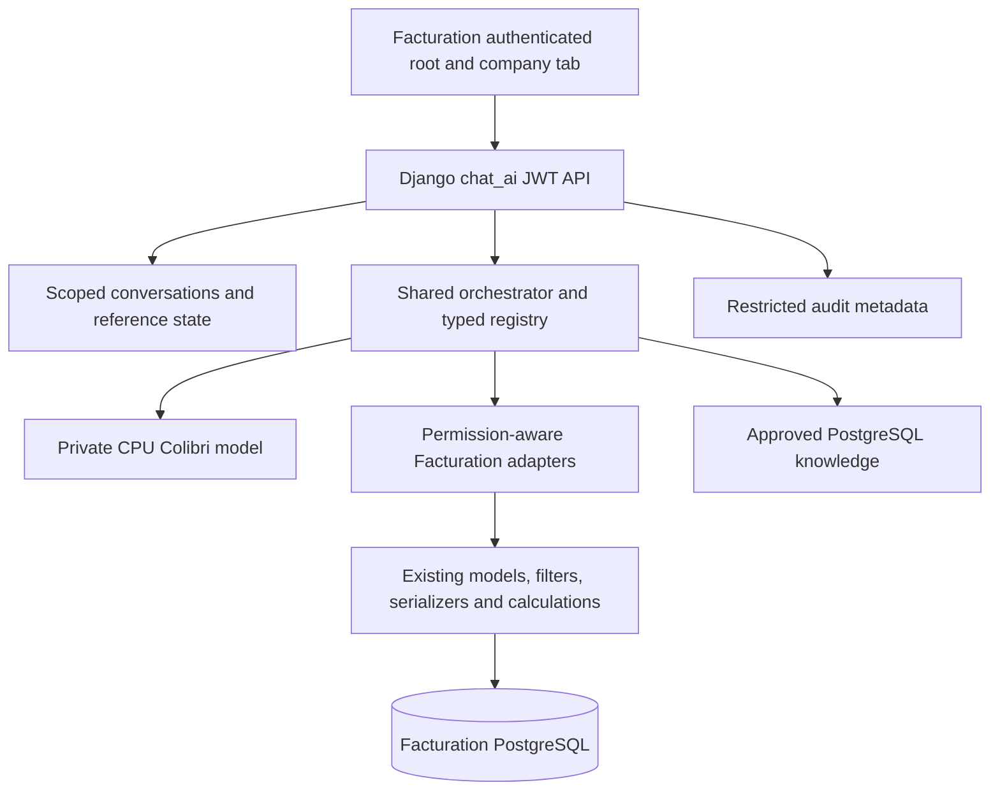

# Chat AI Assistant architecture

Phase 1 integrates **facturation only**. Source is split across the existing backend/frontend repositories; the reusable core, model artifacts, training and operational documentation live in `chat_ai_assistant`. No separate AI backend or replacement login was introduced.

## Request path

1. The dashboard root mounts one feature-flagged `ChatAIAssistant`. Existing NextAuth/Redux credentials authenticate requests through the application's JWT API.
2. The active authorized company tab, a verified detail-route company, or an explicit authorized picker determines the conversation scope. Browser context remains an untrusted hint.
3. Django's `chat_ai` app owns conversations, reference state, inference leases, permission checks and audits. Native membership, stock-superuser and staff-user rules are preserved separately.
4. The core orchestrator offers only permitted tools, with a deterministic multilingual shortlist to reduce prompt size. Colibri returns one typed tool call or a bounded clarification reason. Free-form planner answers are rejected.
5. The executor validates the name and JSON arguments, rechecks permissions, calls a verified application adapter, bounds results and audits the operation. It never evaluates Python, shell, SQL or a model URL.
6. Structured business values go straight to typed cards. Financial calculations come from existing dashboard services. Reviewed bilingual knowledge answers stream verbatim; legacy documents without translations use a bounded second generation call. Source permissions and visible field labels are enforced during streaming.
7. JSON and SSE delivery revalidate conversation scope and referenced records. Stored history contains reference IDs/actions, not copies of business result payloads; reopening re-queries authorization.

## Boundaries and replaceability

- `src/chat_ai_assistant`: transport, contracts, orchestration, presentation guard, tool shortlisting and safe clarification text. It imports no Django application models.
- `facturation_backend/chat_ai`: actual business adapters and authorization. `catalog.py` handles article/payment/user reads; `documents.py` handles pro formas/credit/delivery notes; `operations.py` handles stock/logistics reads.
- `facturation_frontend/src/components/chat-ai`: persistent workspace, panel, shortcuts, typed cards, validated routes and streamed transport.
- `training`: immutable synthetic dataset versions, reproducible server-only LoRA scripts and evaluation records. No normal inference calls external AI services.
- `deploy`: private Colibri deployment with no public inference port; activation and evidence are tracked in AI_PHASE1_REPORT.md.

The backend vendors a wheel built from the central core using `scripts/package_core.py`; the manifest records source and wheel checksums. This avoids a production dependency on the developer's Desktop checkout. Rebuild the wheel after core changes.

## Explicit limits

Writes currently cover bounded document/client metadata and confirmed deletion of supported documents/clients. Stock/logistics lifecycle changes, account administration writes, price changes and payment mutations are not exposed. The existing forms/services remain authoritative. Server training, inference measurements and production Linux image builds are complete. Broad model quality remains below target; see AI_PROGRESS.md and AI_PHASE1_REPORT.md for the actual deployment verification boundary.

Explicit general workflow/help questions route directly through the authorized knowledge tool and reviewed bilingual excerpts. Exact ordinal references route through the same authorized previous-results executor. Specific-record questions and business searches still use the local model; backend authorization and financial results never depend on generated prose. This reduces CPU work and prevents small-model generation failures from corrupting documented procedures or saved result identities.
